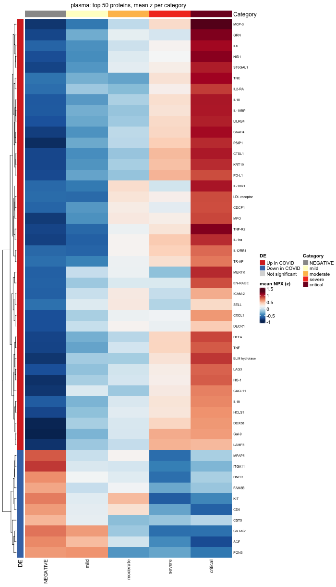

# Olink COVID-19 Explorer

**Live app:** [https://emarquez.shinyapps.io/olink-covid-explorer/](https://emarquezz.shinyapps.io/olink-covid-explorer/)


**A two-matrix reanalysis of the COVID-19 proteome response — Olink NPX, 436 proteins, five panels — built as five verified pipelines, a five-tab Shiny app, and a self-updating report, all reading from the same committed artifacts.**

  ## The story

  The acute COVID-19 proteome response, measured twice. This project reanalyzes Olink data from two sample matrices of the same study — a longitudinal **plasma** subcohort (307 samples) and a **serum** subcohort (63 samples) — and asks four questions:

  1. **What changes in COVID?** (limma DE, POSITIVE vs NEGATIVE)
2. **Do the matrices agree?** (cross-matrix hit sharing, direction concordance, rank correlation)
3. **Does severity structure the response?** (sample PCA, category-average heatmaps)
4. **Is the data trustworthy?** (missingness, outlier, and batch QC — informational, never silently exclusionary)

## TL;DR — the five headline numbers

At a pre-specified FDR of 5%:

  | Finding | Value |
  |---|---|
  | FDR-significant proteins, plasma | **210 of 436** |
  | FDR-significant proteins, serum | **209 of 436** |
  | Significant in **both** matrices | **145** — with **100% direction concordance** |
  | Fold-change correlation across matrices (Spearman ρ, all shared assays) | **0.80** |
  | Intra-individual correlation (plasma, `duplicateCorrelation`) | **r = 0.617** |

  One biological story in two matrices: the acute response — interferon signaling, cytokines, endothelial activation — dominates both. Serum fold changes run systematically steeper (its controls sit closer to baseline); plasma magnitudes are **conservative**, because its negatives are dialysis patients — chronically inflamed relative to healthy donors. And in plasma, the response does not just separate disease from control: **PC1 grades monotonically with clinical severity**, visible both in the PCA and in the category-average heatmap below.



## What's in this repo

| Path | What it is |
  |---|---|
  | `R/run_harmonize.R` | Raw Olink exports → `data/harmonized_npx.rds` (single source of truth) |
  | `R/run_de.R` | limma DE with `duplicateCorrelation` → `outputs/<subcohort>/de_results.rds` |
  | `R/run_pca.R` | Sample PCA on z-scored proteins → `outputs/<subcohort>/pca.rds` |
  | `R/run_heatmap.R` | ComplexHeatmap figures (build-time PNGs) + `heatmap.rds` |
  | `R/run_qc.R` | Missingness / outlier / plate QC → `outputs/<subcohort>/qc.rds` |
  | `outputs/plasma/`, `outputs/serum/` | Committed artifacts: `*.rds` (result + params) + heatmap PNGs |
  | `app.R` | Shiny app, five tabs (see below) |
  | `report.qmd` → `report.html` | Self-contained report; **every number recomputed at render time** |
  | `AI_WORKFLOW.md` | How this was built with AI assistance — process, verification loop, failure anecdotes |
  | `renv.lock` | Pinned package environment |

  ## Quickstart

  ```r
# 0. Restore the pinned environment
renv::restore()

# 1. Explore — the app and report read COMMITTED artifacts, no pipelines needed
shiny::runApp()          # or open report.html in a browser

# 2. Reproduce an analysis from source (example: DE)
library(here)
source("R/run_de.R")
npx <- readRDS(here("data", "harmonized_npx.rds"))
run_de(npx, "plasma", here("outputs", "plasma"))
run_de(npx, "serum",  here("outputs", "serum"))

# 3. Regenerate the report
quarto render report.qmd
```

## The app

`app.R` — five tabs, one sidebar. Run with `shiny::runApp()`; no pipelines needed, all tabs read committed artifacts.

| Tab | Shows | Scope |
  |---|---|---|
  | **Data table** | Per-protein NPX values + sample metadata | Sample-level — respects sidebar filters |
  | **Volcano** | DE results with interactive logFC/FDR thresholds | Cohort-level — filters do not apply |
  | **PCA** | Sample scores on fixed full-cohort axes; color by Group/Sex/Age/Severity/Plate | Sample-level — filtering selects points on fixed axes |
  | **Heatmap** | Build-time ComplexHeatmap PNGs: per-sample (QC view) and category-average (story view) | Cohort-level |
  | **QC** | Assay/sample missingness, PCA-distance outliers, plate balance | Cohort-level |

  Three behaviors worth knowing because they were deliberate:

  - **Two data-fact classes, honestly labeled.** Sample-level views respond to the sidebar; cohort-level *statistics* (DE, heatmap, QC) do not — filtering a volcano plot would misrepresent a fixed statistic. Each cohort tab says so in muted text.
- **Adaptive UI, zero hardcoding.** Serum has no Severity annotation and one plate — so severity options and the plate note simply don't appear there. Choices come from the data/artifacts, not from `if (subcohort == "serum")` branches. (Plasma severity: 51 / 73 / 62 / 74 / 47 across NEG/mild/moderate/severe/critical.)
- **Build-time figure rendering.** ComplexHeatmap draws through grid graphics — no plotly conversion — so heatmaps are rendered once by the pipeline to PNG, and the app just serves images (`renderImage`, `deleteFile = FALSE`). The deployed app never needs ComplexHeatmap; a 50×307 heatmap costs the server nothing.

## The pipelines

Five scripts, run in order; each consumes the previous layer's artifacts rather than recomputing.

```
R/run_harmonize.R  →  data/harmonized_npx.rds        (raw Olink exports → one long table)
│
├─ R/run_de.R       → outputs/<sc>/de_results.rds   (limma + duplicateCorrelation)
├─ R/run_pca.R      → outputs/<sc>/pca.rds          (z-scored sample PCA)
│        └── R/run_qc.R  → outputs/<sc>/qc.rds     (outlier screen reuses pca.rds)
└─ R/run_heatmap.R   → outputs/<sc>/heatmap.png      (top-N reuses de_results.rds)
+ heatmap_categories.png + heatmap.rds
```

**Every pipeline follows the same contract:**

  - Reads `data/harmonized_npx.rds` (or a prior artifact), writes `outputs/<subcohort>/<name>.rds`
- Artifact = `list(result = ..., params = ...)` — the *result* and a *self-describing* record of every choice that produced it (thresholds, ordering rules, imputation counts, timestamps)
- Console messages double as **verification facts**: sample counts, missingness, flagged counts — the run output *is* the QC log
- The **same matrix recipe** (protein × sample pivot → drop >20% missing → median-impute) feeds DE, PCA, and heatmaps — one recipe, three consumers, so no analysis disagrees with another about the data

**Key analytic choices, all pre-specified:**

  - DE: limma linear models, BH FDR across 436 tests; plasma's repeated individuals handled by `duplicateCorrelation` (consensus r = 0.617), not row duplication
- PCA: per-protein z-scores, so PCs reflect correlation structure, not raw NPX abundance
- Outliers: distance to *own-group* centroid in PC1–PC5, robust z (median/MAD), one-sided z > 3 — the disease signal cannot masquerade as outlyingness

## Design rules

The principles this repo is built on — the "why" behind the structure:

1. **One source of truth.** `harmonized_npx.rds` is the only data file anything reads. Pipelines transform it; nothing bypasses it.
2. **Artifacts describe themselves.** Statistics are computed *once*, committed, and served — the app never recomputes limma, PCA, or QC at runtime; UIs adapt by *reading* `params`, not by branching on subcohort names. Report, app, and data cannot drift apart.
3. **A verified-facts ledger.** Nothing enters the README or report unverified. Each fact traces to a console line from a pipeline run (e.g. "436 proteins × 307 samples, 0 dropped, 275 imputed") — the run log *is* the evidence chain.
4. **QC informs; pre-specified rules exclude.** No sample is dropped because QC looked at it afterward — that's how p-hacking starts. Flags are informational; any exclusion would have been declared before analysis.
5. **Pre-specify conventions before looking.** Direction labels, threshold values, category orders (NEG → mild → moderate → severe → critical) — fixed before results existed, so no choice downstream quietly follows a desired answer.
6. **Heavy figures render at build time.** What can't be cheap at runtime (grid-based ComplexHeatmap) is computed once and served as an artifact.
7. **Interactive filtering must be statistically safe.** Filtering a plot's *points* is fine when the axes are fixed by a full-cohort artifact; recomputing a *statistic* on a filtered subset silently changes the science.

## Methods, in one pass

**Cohorts.** Plasma: 307 samples (256 COVID-positive, 51 negative), longitudinal — repeated individuals per patient. Serum: 63 samples (52 positive, 11 negative). Both: 436 proteins across five Olink panels (CM 90, CVD2 87, CVD3 87, Inflammation 85, Immune Response 87).

A note on the control group that shapes every plasma result: the negatives are **dialysis patients**, chronically inflamed relative to healthy donors. Observed plasma effect sizes are therefore *conservative* — direction is robust, magnitude understates what a healthy-baseline study would see. Serum's smaller, cleaner control gap is why its fold changes run steeper.

**Analysis.** DE per protein via limma (BH FDR across 436 tests); plasma's repeated individuals modeled by `duplicateCorrelation` (consensus r = 0.617). Sample PCA on per-protein z-scores. One shared matrix recipe everywhere: >20% missing drops a protein (none were), otherwise median-impute. Full detail with live-computed numbers: **`report.html`**.

## Data quality — verified facts

Every fact below traces to a console line from a pipeline run:

  | Fact | Value |
  |---|---|
  | Plasma missingness | 275 of 133,852 cells (0.21%) |
  | Serum missingness | 97 of 27,468 cells (0.35%) |
  | Assays / samples over 20% missing | 0 / 0 (both subcohorts) |
  | Plasma missingness concentration | 3 samples with full-panel dropouts = **261 of 275 missing cells (95%)** |
  | Duplicated-row guard | silent (uniqueness held) |
  | Plasma severity annotation | complete: 51 / 73 / 62 / 74 / 47 across NEG / mild / moderate / severe / critical — zero NA |
  | Outliers flagged (robust z > 3, within-group PC distance) | 6 plasma (all POSITIVE, z 3.27–4.93); 0 serum |
  | Plate balance (plasma) | controls on every plate by design: 10 / 10 / 10 / 11 / 10 |

  The missingness story in one sentence: it's not scattered noise — it's **three samples that each lost one entire panel** (`C10_6` and `C189_345` lost the 87-assay CVD2 panel; `C224_361` lost the 87-assay IR panel; all their other panels fully observed). Each lands at 19.95% missing — just under the pre-specified 20% threshold — so the rule retains them. QC flags are informational: no samples are excluded anywhere in this project, because no exclusion rule was pre-specified. A sensitivity re-run without these three is queued as future work, not done post hoc.

The outlier screen is honest by construction: distance is measured to the sample's **own group's** centroid, so "being very COVID" can't register as "being an outlier." The six flagged plasma positives are genuinely extreme members of the positive cloud — heterogeneity of the disease, retained per policy.

## Limitations

- **Dialysis controls** compress plasma effect sizes (see Methods).
- **Serum power**: 11 controls — serum-only findings carry wide uncertainty.
- **Unbridged matrices**: no Olink bridge normalization links the subcohorts; all statistics are within-matrix. Cross-matrix statements are qualitative (direction, rank), never quantitative equivalence.
- **No LOD data**: limit-of-detection flags aren't computable from the harmonized dataset — recorded in QC artifacts, not silently ignored.

## Future work

1. **Severity contrast DE** (severe vs mild among positives — bins of 74 vs 73 make it feasible). The PC1 dose-response says it will replicate.
2. **Sensitivity re-run** excluding the three panel-dropout samples; diff against current `de_results.rds`.
3. **LOD-aware QC** if limit-of-detection fields become available.

## Reproducibility & repo hygiene

- **Everything pinned**: `renv.lock` (R packages), committed artifacts (`outputs/`), committed harmonized data (`data/harmonized_npx.rds`). A fresh clone + `renv::restore()` runs the app and renders the report with zero pipeline execution.
- **Raw source files stay out of git**; the harmonized table is the committed single source of truth. Before making this repo public, confirm the source data's sensitivity/licensing terms.
- **Commits follow one-change-per-commit** with summary + description; the build history doubles as the project's decision log.

---

  *Built pipeline-first with AI assistance (see `AI_WORKFLOW.md` for the process, the verification loop, and the honest failure log). Status: analysis complete, app feature-complete, report rendered. Next: deployment.*
